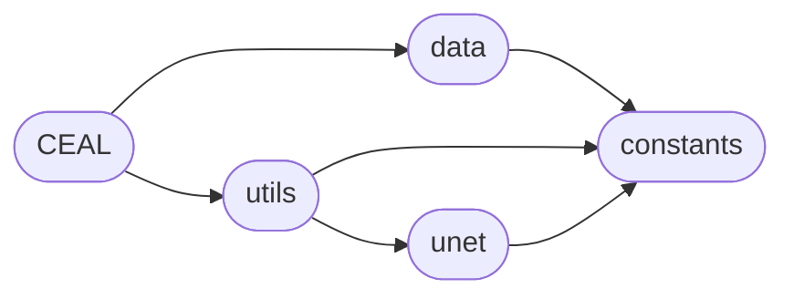

# Code Overview

[_Documentation generated by Documatic_](https://www.documatic.com)

<!---Documatic-section-Codebase Structure Python-start--->
## Codebase Structure Python

The codebase has a flat structure, with 5 code files.

<!---Documatic-block-system_architecture-start--->

<!---Documatic-block-system_architecture-end--->

# #
<!---Documatic-section-Codebase Structure Python-end--->

<!---Documatic-section-Important Functions-start--->
## Important Functions

<!---Documatic-block-important_funcs-start--->
<!---Documatic-block-most_used_funcs-start--->
### Most Utilised Functions

* src.constants.img_cols (3 times)
* src.constants.img_rows (3 times)
* src.constants.apply_augmentation (2 times)
* src.constants.apply_edt (2 times)
* src.constants.batch_size (2 times)
* src.constants.final_weights_path (2 times)
* src.constants.global_path (2 times)
* src.constants.initial_train (2 times)
* src.constants.initial_weights_path (2 times)
* src.constants.most_uncertain_rate (2 times)
* src.constants.nb_active_epochs (2 times)
* src.constants.nb_initial_epochs (2 times)
* src.constants.nb_iterations (2 times)
* src.constants.nb_labeled (2 times)
* src.constants.nb_most_uncertain (2 times)
* src.constants.nb_no_detections (2 times)
* src.constants.nb_pseudo_initial (2 times)
* src.constants.nb_random (2 times)
* src.constants.nb_step_predictions (2 times)
* src.constants.nb_total (2 times)
* src.constants.nb_train (2 times)
* src.constants.nb_unlabeled (2 times)
* src.constants.pseudo_epoch (2 times)
* src.constants.pseudo_rate (2 times)
* [src.unet.get_unet](5-src_unet.md#src.unet.get_unet) (1 times)
<!---Documatic-block-most_used_funcs-end--->
<!---Documatic-block-important_funcs-end--->

# #
<!---Documatic-section-Important Functions-end--->

<!---Documatic-section-File IO-start--->
## File IO

<!---Documatic-block-file_io-start--->
The following files have file read operations

<!---Documatic-block-src-start--->

	
<code>src</code> (Click to Expand!)

* src.data: skin_database/imgs_mask_train.npy.gz, skin_database/imgs_train.npy.gz

<!---Documatic-block-src-end--->

The following files have file write operations

<!---Documatic-block-src-start--->

	
<code>src</code> (Click to Expand!)

* src.CEAL

<!---Documatic-block-src-end--->
<!---Documatic-block-file_io-end--->

# #
<!---Documatic-section-File IO-end--->

[_Documentation generated by Documatic_](https://www.documatic.com)