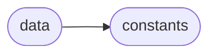
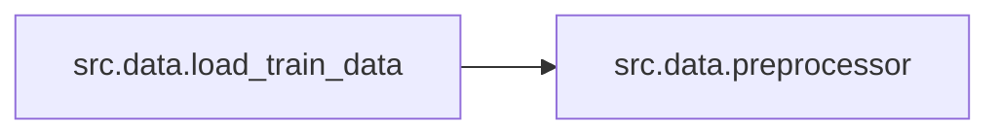

# Src Data

[_Documentation generated by Documatic_](https://www.documatic.com)

<!---Documatic-section-Codebase Structure-start--->
## Codebase Structure

<!---Documatic-block-system_architecture-start--->

<!---Documatic-block-system_architecture-end--->

# #
<!---Documatic-section-Codebase Structure-end--->

<!---Documatic-section-src.data.preprocessor-start--->
## [src.data.preprocessor](3-src_data.md#src.data.preprocessor)

<!---Documatic-section-preprocessor-start--->
### Summary

Resizes the input image by resizing it with cv2.

<!---Documatic-block-src.data.preprocessor-start--->
<details>
	<summary><code>src.data.preprocessor</code> code snippet</summary>

```python
def preprocessor(input_img):
    output_img = np.ndarray((input_img.shape[0], input_img.shape[1], img_rows, img_cols), dtype=np.uint8)
    for i in range(input_img.shape[0]):
        output_img[i, 0] = cv2.resize(input_img[i, 0], (img_cols, img_rows), interpolation=cv2.INTER_CUBIC)
    return output_img
```
</details>
<!---Documatic-block-src.data.preprocessor-end--->
<!---Documatic-section-preprocessor-end--->

# #
<!---Documatic-section-src.data.preprocessor-end--->

<!---Documatic-section-src.data.create_train_data-start--->
## [src.data.create_train_data](3-src_data.md#src.data.create_train_data)

<!---Documatic-section-create_train_data-start--->
### Summary

Create training and mask images.

<!---Documatic-block-src.data.create_train_data-start--->
<details>
	<summary><code>src.data.create_train_data</code> code snippet</summary>

```python
def create_train_data():
    image_rows = 420
    image_cols = 580
    images = os.listdir(data_path)
    masks = os.listdir(masks_path)
    total = len(images)
    imgs = np.ndarray((total, 1, image_rows, image_cols), dtype=np.uint8)
    imgs_mask = np.ndarray((total, 1, image_rows, image_cols), dtype=np.uint8)
    for image_name in images:
        img = cv2.imread(os.path.join(data_path, image_name), cv2.IMREAD_GRAYSCALE)
        img = cv2.resize(img, (image_rows, image_cols), interpolation=cv2.INTER_CUBIC)
        img = np.array([img])
        imgs[i] = img
    for image_mask_name in masks:
        img_mask = cv2.imread(os.path.join(masks_path, image_mask_name), cv2.IMREAD_GRAYSCALE)
        img_mask = cv2.resize(img_mask, (image_rows, image_cols), interpolation=cv2.INTER_CUBIC)
        img_mask = np.array([img_mask])
        imgs_mask[i] = img_mask
    np.save('imgs_train.npy', imgs)
    np.save('imgs_mask_train.npy', imgs_mask)
```
</details>
<!---Documatic-block-src.data.create_train_data-end--->
<!---Documatic-section-create_train_data-end--->

# #
<!---Documatic-section-src.data.create_train_data-end--->

<!---Documatic-section-src.data.load_train_data-start--->
## [src.data.load_train_data](3-src_data.md#src.data.load_train_data)

<!---Documatic-section-load_train_data-start--->


### Summary

Load training data.

### Object Calls

* [src.data.preprocessor](3-src_data.md#src.data.preprocessor)

<!---Documatic-block-src.data.load_train_data-start--->
<details>
	<summary><code>src.data.load_train_data</code> code snippet</summary>

```python
def load_train_data():
    print('\nLoading train data...\n')
    X_train = np.load(gzip.open('skin_database/imgs_train.npy.gz'))
    y_train = np.load(gzip.open('skin_database/imgs_mask_train.npy.gz'))
    X_train = preprocessor(X_train)
    y_train = preprocessor(y_train)
    X_train = X_train.astype('float32')
    mean = np.mean(X_train)
    std = np.std(X_train)
    X_train -= mean
    X_train /= std
    y_train = y_train.astype('float32')
    y_train /= 255.0
    return (X_train, y_train)
```
</details>
<!---Documatic-block-src.data.load_train_data-end--->
<!---Documatic-section-load_train_data-end--->

# #
<!---Documatic-section-src.data.load_train_data-end--->

[_Documentation generated by Documatic_](https://www.documatic.com)