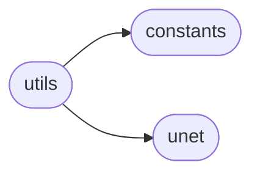
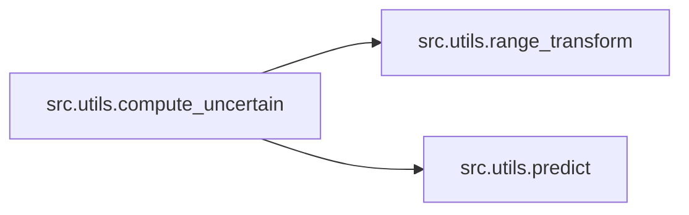
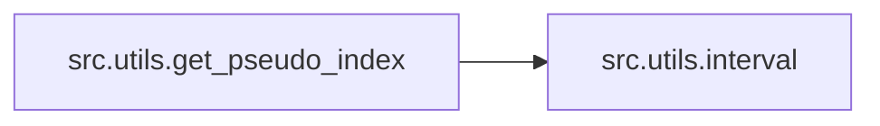
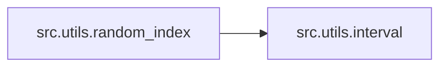
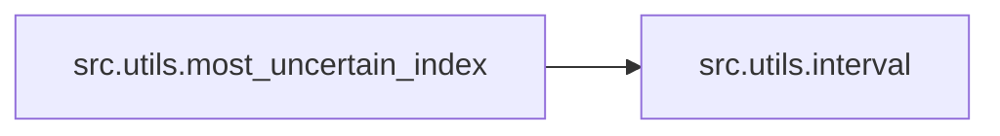
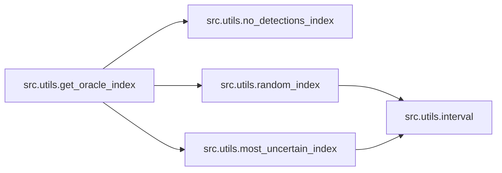
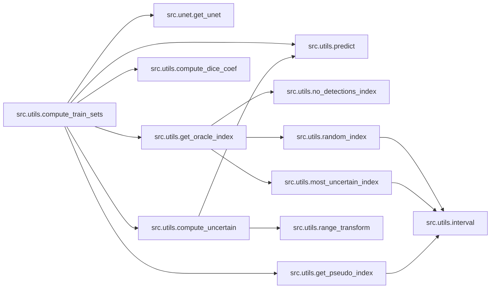

# Src Utils

[_Documentation generated by Documatic_](https://www.documatic.com)

<!---Documatic-section-Codebase Structure-start--->
## Codebase Structure

<!---Documatic-block-system_architecture-start--->

<!---Documatic-block-system_architecture-end--->

# #
<!---Documatic-section-Codebase Structure-end--->

<!---Documatic-section-src.utils.range_transform-start--->
## [src.utils.range_transform](4-src_utils.md#src.utils.range_transform)

<!---Documatic-section-range_transform-start--->
### Summary

Transform a sample from 0 - 1 to 255.

<!---Documatic-block-src.utils.range_transform-start--->
<details>
	<summary><code>src.utils.range_transform</code> code snippet</summary>

```python
def range_transform(sample):
    if np.max(sample) == 1:
        sample = sample * 255
    m = 255 / (np.max(sample) - np.min(sample))
    n = 255 - m * np.max(sample)
    return (m * sample + n) / 255
```
</details>
<!---Documatic-block-src.utils.range_transform-end--->
<!---Documatic-section-range_transform-end--->

# #
<!---Documatic-section-src.utils.range_transform-end--->

<!---Documatic-section-src.utils.predict-start--->
## [src.utils.predict](4-src_utils.md#src.utils.predict)

<!---Documatic-section-predict-start--->
### Summary

Predict a model on the data.

<!---Documatic-block-src.utils.predict-start--->
<details>
	<summary><code>src.utils.predict</code> code snippet</summary>

```python
def predict(data, model):
    return model.predict(data, verbose=0)
```
</details>
<!---Documatic-block-src.utils.predict-end--->
<!---Documatic-section-predict-end--->

# #
<!---Documatic-section-src.utils.predict-end--->

<!---Documatic-section-src.utils.compute_uncertain-start--->
## [src.utils.compute_uncertain](4-src_utils.md#src.utils.compute_uncertain)

<!---Documatic-section-compute_uncertain-start--->


### Summary

Compute the uncertain distribution.

### Object Calls

* [src.utils.range_transform](4-src_utils.md#src.utils.range_transform)
* [src.utils.predict](4-src_utils.md#src.utils.predict)

<!---Documatic-block-src.utils.compute_uncertain-start--->
<details>
	<summary><code>src.utils.compute_uncertain</code> code snippet</summary>

```python
def compute_uncertain(sample, prediction, model):
    X = np.zeros([1, img_rows, img_cols])
    for t in range(nb_step_predictions):
        prediction = model.predict(sample, verbose=0).reshape([1, img_rows, img_cols])
        X = np.concatenate((X, prediction))
    X = np.delete(X, [0], 0)
    if apply_edt:
        var = np.var(X, axis=0)
        transform = range_transform(edt(prediction))
        return np.sum(var * transform)
    else:
        return np.sum(np.var(X, axis=0))
```
</details>
<!---Documatic-block-src.utils.compute_uncertain-end--->
<!---Documatic-section-compute_uncertain-end--->

# #
<!---Documatic-section-src.utils.compute_uncertain-end--->

<!---Documatic-section-src.utils.interval-start--->
## [src.utils.interval](4-src_utils.md#src.utils.interval)

<!---Documatic-section-interval-start--->
### Summary

Returns the interval of data between start and end.

<!---Documatic-block-src.utils.interval-start--->
<details>
	<summary><code>src.utils.interval</code> code snippet</summary>

```python
def interval(data, start, end):
    p = np.where(data >= start)[0]
    return p[np.where(data[p] < end)[0]]
```
</details>
<!---Documatic-block-src.utils.interval-end--->
<!---Documatic-section-interval-end--->

# #
<!---Documatic-section-src.utils.interval-end--->

<!---Documatic-section-src.utils.get_pseudo_index-start--->
## [src.utils.get_pseudo_index](4-src_utils.md#src.utils.get_pseudo_index)

<!---Documatic-section-get_pseudo_index-start--->


### Summary

Get a pseudo index from an uncertain sequence.

### Object Calls

* [src.utils.interval](4-src_utils.md#src.utils.interval)

<!---Documatic-block-src.utils.get_pseudo_index-start--->
<details>
	<summary><code>src.utils.get_pseudo_index</code> code snippet</summary>

```python
def get_pseudo_index(uncertain, nb_pseudo):
    h = np.histogram(uncertain, 80)
    pseudo = interval(uncertain, h[1][np.argmax(h[0])], h[1][np.argmax(h[0]) + 1])
    np.random.shuffle(pseudo)
    return pseudo[0:nb_pseudo]
```
</details>
<!---Documatic-block-src.utils.get_pseudo_index-end--->
<!---Documatic-section-get_pseudo_index-end--->

# #
<!---Documatic-section-src.utils.get_pseudo_index-end--->

<!---Documatic-section-src.utils.random_index-start--->
## [src.utils.random_index](4-src_utils.md#src.utils.random_index)

<!---Documatic-section-random_index-start--->


### Summary

Generate a random index from the uncertain array.

### Object Calls

* [src.utils.interval](4-src_utils.md#src.utils.interval)

<!---Documatic-block-src.utils.random_index-start--->
<details>
	<summary><code>src.utils.random_index</code> code snippet</summary>

```python
def random_index(uncertain, nb_random):
    histo = np.histogram(uncertain, 80)
    index = interval(uncertain, histo[1][np.argmax(histo[0]) + 6], histo[1][len(histo[0]) - 33])
    np.random.shuffle(index)
    return index[0:nb_random]
```
</details>
<!---Documatic-block-src.utils.random_index-end--->
<!---Documatic-section-random_index-end--->

# #
<!---Documatic-section-src.utils.random_index-end--->

<!---Documatic-section-src.utils.no_detections_index-start--->
## [src.utils.no_detections_index](4-src_utils.md#src.utils.no_detections_index)

<!---Documatic-section-no_detections_index-start--->
### Summary

Returns the index of no detections.

<!---Documatic-block-src.utils.no_detections_index-start--->
<details>
	<summary><code>src.utils.no_detections_index</code> code snippet</summary>

```python
def no_detections_index(uncertain, nb_no_detections):
    return np.argsort(uncertain)[0:nb_no_detections]
```
</details>
<!---Documatic-block-src.utils.no_detections_index-end--->
<!---Documatic-section-no_detections_index-end--->

# #
<!---Documatic-section-src.utils.no_detections_index-end--->

<!---Documatic-section-src.utils.most_uncertain_index-start--->
## [src.utils.most_uncertain_index](4-src_utils.md#src.utils.most_uncertain_index)

<!---Documatic-section-most_uncertain_index-start--->


### Summary

Generate a list of indices for the most uncertain index.

### Object Calls

* [src.utils.interval](4-src_utils.md#src.utils.interval)

<!---Documatic-block-src.utils.most_uncertain_index-start--->
<details>
	<summary><code>src.utils.most_uncertain_index</code> code snippet</summary>

```python
def most_uncertain_index(uncertain, nb_most_uncertain, rate):
    data = np.array([]).astype('int')
    histo = np.histogram(uncertain, 80)
    p = np.arange(len(histo[0]) - rate, len(histo[0]))
    pr = np.argsort(histo[0][p])
    cnt = 0
    pos = 0
    index = np.array([]).astype('int')
    while cnt < nb_most_uncertain and pos < len(pr):
        sbin = histo[0][p[pr[pos]]]
        index = np.append(index, p[pr[pos]])
        cnt = cnt + sbin
        pos = pos + 1
    for i in range(0, pos):
        data = np.concatenate((data, interval(uncertain, histo[1][index[i]], histo[1][index[i] + 1])))
    np.random.shuffle(data)
    return data[0:nb_most_uncertain]
```
</details>
<!---Documatic-block-src.utils.most_uncertain_index-end--->
<!---Documatic-section-most_uncertain_index-end--->

# #
<!---Documatic-section-src.utils.most_uncertain_index-end--->

<!---Documatic-section-src.utils.get_oracle_index-start--->
## [src.utils.get_oracle_index](4-src_utils.md#src.utils.get_oracle_index)

<!---Documatic-section-get_oracle_index-start--->


### Summary

Return an index of the oracle data.

### Object Calls

* [src.utils.no_detections_index](4-src_utils.md#src.utils.no_detections_index)
* [src.utils.random_index](4-src_utils.md#src.utils.random_index)
* [src.utils.most_uncertain_index](4-src_utils.md#src.utils.most_uncertain_index)

<!---Documatic-block-src.utils.get_oracle_index-start--->
<details>
	<summary><code>src.utils.get_oracle_index</code> code snippet</summary>

```python
def get_oracle_index(uncertain, nb_no_detections, nb_random, nb_most_uncertain, rate):
    return np.concatenate((no_detections_index(uncertain, nb_no_detections), random_index(uncertain, nb_random), most_uncertain_index(uncertain, nb_most_uncertain, rate)))
```
</details>
<!---Documatic-block-src.utils.get_oracle_index-end--->
<!---Documatic-section-get_oracle_index-end--->

# #
<!---Documatic-section-src.utils.get_oracle_index-end--->

<!---Documatic-section-src.utils.compute_dice_coef-start--->
## [src.utils.compute_dice_coef](4-src_utils.md#src.utils.compute_dice_coef)

<!---Documatic-section-compute_dice_coef-start--->
### Summary

Compute the dice coefficient.

<!---Documatic-block-src.utils.compute_dice_coef-start--->
<details>
	<summary><code>src.utils.compute_dice_coef</code> code snippet</summary>

```python
def compute_dice_coef(y_true, y_pred):
    smooth = 1.0
    y_true_f = y_true.reshape([1, img_rows * img_cols])
    y_pred_f = y_pred.reshape([1, img_rows * img_cols])
    intersection = np.sum(y_true_f * y_pred_f)
    return (2.0 * intersection + smooth) / (np.sum(y_true_f) + np.sum(y_pred_f) + smooth)
```
</details>
<!---Documatic-block-src.utils.compute_dice_coef-end--->
<!---Documatic-section-compute_dice_coef-end--->

# #
<!---Documatic-section-src.utils.compute_dice_coef-end--->

<!---Documatic-section-src.utils.compute_train_sets-start--->
## [src.utils.compute_train_sets](4-src_utils.md#src.utils.compute_train_sets)

<!---Documatic-section-compute_train_sets-start--->


### Summary

Compute the train and label sets.

### Object Calls

* [src.unet.get_unet](5-src_unet.md#src.unet.get_unet)
* [src.utils.predict](4-src_utils.md#src.utils.predict)
* [src.utils.get_oracle_index](4-src_utils.md#src.utils.get_oracle_index)
* [src.utils.compute_dice_coef](4-src_utils.md#src.utils.compute_dice_coef)
* [src.utils.compute_uncertain](4-src_utils.md#src.utils.compute_uncertain)
* [src.utils.get_pseudo_index](4-src_utils.md#src.utils.get_pseudo_index)

<!---Documatic-block-src.utils.compute_train_sets-start--->
<details>
	<summary><code>src.utils.compute_train_sets</code> code snippet</summary>

```python
def compute_train_sets(X_train, y_train, labeled_index, unlabeled_index, weights, iteration):
    print('\nActive iteration ' + str(iteration))
    print('-' * 50 + '\n')
    modelUncertain = get_unet(dropout=True)
    modelUncertain.load_weights(weights)
    modelPredictions = get_unet(dropout=False)
    modelPredictions.load_weights(weights)
    print('Computing log predictions ...\n')
    predictions = predict(X_train[unlabeled_index], modelPredictions)
    uncertain = np.zeros(len(unlabeled_index))
    accuracy = np.zeros(len(unlabeled_index))
    print('Computing train sets ...')
    for index in range(0, len(unlabeled_index)):
        if index % 100 == 0:
            print('completed: ' + str(index) + '/' + str(len(unlabeled_index)))
        sample = X_train[unlabeled_index[index]].reshape([1, 1, img_rows, img_cols])
        sample_prediction = cv2.threshold(predictions[index], 0.5, 1, cv2.THRESH_BINARY)[1].astype('uint8')
        accuracy[index] = compute_dice_coef(y_train[unlabeled_index[index]][0], sample_prediction)
        uncertain[index] = compute_uncertain(sample, sample_prediction, modelUncertain)
    np.save(global_path + 'logs/uncertain' + str(iteration), uncertain)
    np.save(global_path + 'logs/accuracy' + str(iteration), accuracy)
    oracle_index = get_oracle_index(uncertain, nb_no_detections, nb_random, nb_most_uncertain, most_uncertain_rate)
    oracle_rank = unlabeled_index[oracle_index]
    np.save(global_path + 'ranks/oracle' + str(iteration), oracle_rank)
    np.save(global_path + 'ranks/oraclelogs' + str(iteration), oracle_index)
    labeled_index = np.concatenate((labeled_index, oracle_rank))
    if iteration >= pseudo_epoch:
        pseudo_index = get_pseudo_index(uncertain, nb_pseudo_initial + pseudo_rate * (iteration - pseudo_epoch))
        pseudo_rank = unlabeled_index[pseudo_index]
        np.save(global_path + 'ranks/pseudo' + str(iteration), pseudo_rank)
        np.save(global_path + 'ranks/pseudologs' + str(iteration), pseudo_index)
        X_labeled_train = np.concatenate((X_train[labeled_index], X_train[pseudo_index]))
        y_labeled_train = np.concatenate((y_train[labeled_index], predictions[pseudo_index]))
    else:
        X_labeled_train = np.concatenate(X_train[labeled_index]).reshape([len(labeled_index), 1, img_rows, img_cols])
        y_labeled_train = np.concatenate(y_train[labeled_index]).reshape([len(labeled_index), 1, img_rows, img_cols])
    unlabeled_index = np.delete(unlabeled_index, oracle_index, 0)
    return (X_labeled_train, y_labeled_train, labeled_index, unlabeled_index)
```
</details>
<!---Documatic-block-src.utils.compute_train_sets-end--->
<!---Documatic-section-compute_train_sets-end--->

# #
<!---Documatic-section-src.utils.compute_train_sets-end--->

<!---Documatic-section-src.utils.data_generator-start--->
## [src.utils.data_generator](4-src_utils.md#src.utils.data_generator)

<!---Documatic-section-data_generator-start--->
### Summary

Returns an ImageDataGenerator instance.

<!---Documatic-block-src.utils.data_generator-start--->
<details>
	<summary><code>src.utils.data_generator</code> code snippet</summary>

```python
def data_generator():
    return ImageDataGenerator(featurewise_center=True, featurewise_std_normalization=True, width_shift_range=0.2, rotation_range=40, horizontal_flip=True)
```
</details>
<!---Documatic-block-src.utils.data_generator-end--->
<!---Documatic-section-data_generator-end--->

# #
<!---Documatic-section-src.utils.data_generator-end--->

<!---Documatic-section-src.utils.log-start--->
## [src.utils.log](4-src_utils.md#src.utils.log)

<!---Documatic-section-log-start--->
### Summary

Write a log file for the given history object.

<!---Documatic-block-src.utils.log-start--->
<details>
	<summary><code>src.utils.log</code> code snippet</summary>

```python
def log(history, step, log_file):
    for i in range(0, len(history.history['loss'])):
        if len(history.history.keys()) == 4:
            log_file.write('{0} {1} {2} {3} \n'.format(str(step), str(i), str(history.history['loss'][i]), str(history.history['val_dice_coef'][i])))
```
</details>
<!---Documatic-block-src.utils.log-end--->
<!---Documatic-section-log-end--->

# #
<!---Documatic-section-src.utils.log-end--->

<!---Documatic-section-src.utils.create_paths-start--->
## [src.utils.create_paths](4-src_utils.md#src.utils.create_paths)

<!---Documatic-section-create_paths-start--->
### Summary

Create all paths needed for the n - language files.

<!---Documatic-block-src.utils.create_paths-start--->
<details>
	<summary><code>src.utils.create_paths</code> code snippet</summary>

```python
def create_paths():
    path_ranks = global_path + 'ranks/'
    path_logs = global_path + 'logs/'
    path_plots = global_path + 'plots/'
    path_models = global_path + 'models/'
    if not os.path.exists(path_ranks):
        os.makedirs(path_ranks)
        print('Path created: ', path_ranks)
    if not os.path.exists(path_logs):
        os.makedirs(path_logs)
        print('Path created: ', path_logs)
    if not os.path.exists(path_plots):
        os.makedirs(path_plots)
        print('Path created: ', path_plots)
    if not os.path.exists(path_models):
        os.makedirs(path_models)
        print('Path created: ', path_models)
```
</details>
<!---Documatic-block-src.utils.create_paths-end--->
<!---Documatic-section-create_paths-end--->

# #
<!---Documatic-section-src.utils.create_paths-end--->

[_Documentation generated by Documatic_](https://www.documatic.com)