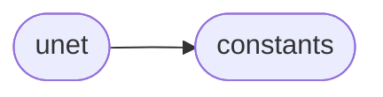
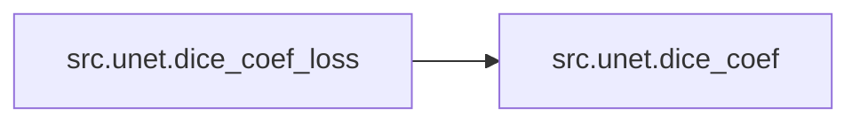

# Src Unet

[_Documentation generated by Documatic_](https://www.documatic.com)

<!---Documatic-section-Codebase Structure-start--->
## Codebase Structure

<!---Documatic-block-system_architecture-start--->

<!---Documatic-block-system_architecture-end--->

# #
<!---Documatic-section-Codebase Structure-end--->

<!---Documatic-section-src.unet.dice_coef-start--->
## [src.unet.dice_coef](5-src_unet.md#src.unet.dice_coef)

<!---Documatic-section-dice_coef-start--->
### Summary

Dice coefficient.

<!---Documatic-block-src.unet.dice_coef-start--->
<details>
	<summary><code>src.unet.dice_coef</code> code snippet</summary>

```python
def dice_coef(y_true, y_pred):
    y_true_f = K.flatten(y_true)
    y_pred_f = K.flatten(y_pred)
    intersection = K.sum(y_true_f * y_pred_f)
    return (2.0 * intersection + smooth) / (K.sum(y_true_f) + K.sum(y_pred_f) + smooth)
```
</details>
<!---Documatic-block-src.unet.dice_coef-end--->
<!---Documatic-section-dice_coef-end--->

# #
<!---Documatic-section-src.unet.dice_coef-end--->

<!---Documatic-section-src.unet.dice_coef_loss-start--->
## [src.unet.dice_coef_loss](5-src_unet.md#src.unet.dice_coef_loss)

<!---Documatic-section-dice_coef_loss-start--->


### Summary

Dice coefficient loss.

### Object Calls

* [src.unet.dice_coef](5-src_unet.md#src.unet.dice_coef)

<!---Documatic-block-src.unet.dice_coef_loss-start--->
<details>
	<summary><code>src.unet.dice_coef_loss</code> code snippet</summary>

```python
def dice_coef_loss(y_true, y_pred):
    return -dice_coef(y_true, y_pred)
```
</details>
<!---Documatic-block-src.unet.dice_coef_loss-end--->
<!---Documatic-section-dice_coef_loss-end--->

# #
<!---Documatic-section-src.unet.dice_coef_loss-end--->

<!---Documatic-section-src.unet.call-start--->
## [src.unet.call](5-src_unet.md#src.unet.call)

<!---Documatic-section-call-start--->
### Summary

Call the Kalman filter in training or test phase.

<!---Documatic-block-src.unet.call-start--->
<details>
	<summary><code>src.unet.call</code> code snippet</summary>

```python
def call(self, inputs, training=None):
    if 0.0 < self.rate < 1.0:
        noise_shape = self._get_noise_shape(inputs)

        def dropped_inputs():
            return K.dropout(inputs, self.rate, noise_shape, seed=self.seed)
        if training:
            return K.in_train_phase(dropped_inputs, inputs, training=training)
        else:
            return K.in_test_phase(dropped_inputs, inputs, training=None)
    return inputs
```
</details>
<!---Documatic-block-src.unet.call-end--->
<!---Documatic-section-call-end--->

# #
<!---Documatic-section-src.unet.call-end--->

<!---Documatic-section-src.unet.get_unet-start--->
## [src.unet.get_unet](5-src_unet.md#src.unet.get_unet)

<!---Documatic-section-get_unet-start--->
### Summary

Get the unet model.

<!---Documatic-block-src.unet.get_unet-start--->
<details>
	<summary><code>src.unet.get_unet</code> code snippet</summary>

```python
def get_unet(dropout):
    inputs = Input((1, img_rows, img_cols))
    conv1 = Convolution2D(32, 3, 3, activation='relu', border_mode='same')(inputs)
    conv1 = Convolution2D(32, 3, 3, activation='relu', border_mode='same')(conv1)
    pool1 = MaxPooling2D(pool_size=(2, 2))(conv1)
    conv2 = Convolution2D(64, 3, 3, activation='relu', border_mode='same')(pool1)
    conv2 = Convolution2D(64, 3, 3, activation='relu', border_mode='same')(conv2)
    pool2 = MaxPooling2D(pool_size=(2, 2))(conv2)
    conv3 = Convolution2D(128, 3, 3, activation='relu', border_mode='same')(pool2)
    conv3 = Convolution2D(128, 3, 3, activation='relu', border_mode='same')(conv3)
    pool3 = MaxPooling2D(pool_size=(2, 2))(conv3)
    conv4 = Convolution2D(256, 3, 3, activation='relu', border_mode='same')(pool3)
    conv4 = Convolution2D(256, 3, 3, activation='relu', border_mode='same')(conv4)
    pool4 = MaxPooling2D(pool_size=(2, 2))(conv4)
    conv5 = Convolution2D(512, 3, 3, activation='relu', border_mode='same')(pool4)
    conv5 = Convolution2D(512, 3, 3, activation='relu', border_mode='same')(conv5)
    if dropout:
        conv5 = Dropout(0.5)(conv5)
    up6 = merge([UpSampling2D(size=(2, 2))(conv5), conv4], mode='concat', concat_axis=1)
    conv6 = Convolution2D(256, 3, 3, activation='relu', border_mode='same')(up6)
    conv6 = Convolution2D(256, 3, 3, activation='relu', border_mode='same')(conv6)
    up7 = merge([UpSampling2D(size=(2, 2))(conv6), conv3], mode='concat', concat_axis=1)
    conv7 = Convolution2D(128, 3, 3, activation='relu', border_mode='same')(up7)
    conv7 = Convolution2D(128, 3, 3, activation='relu', border_mode='same')(conv7)
    up8 = merge([UpSampling2D(size=(2, 2))(conv7), conv2], mode='concat', concat_axis=1)
    conv8 = Convolution2D(64, 3, 3, activation='relu', border_mode='same')(up8)
    conv8 = Convolution2D(64, 3, 3, activation='relu', border_mode='same')(conv8)
    up9 = merge([UpSampling2D(size=(2, 2))(conv8), conv1], mode='concat', concat_axis=1)
    conv9 = Convolution2D(32, 3, 3, activation='relu', border_mode='same')(up9)
    conv9 = Convolution2D(32, 3, 3, activation='relu', border_mode='same')(conv9)
    conv10 = Convolution2D(1, 1, 1, activation='sigmoid')(conv9)
    model = Model(input=inputs, output=conv10)
    model.compile(optimizer=Adam(lr=1e-05), loss=dice_coef_loss, metrics=[dice_coef])
    return model
```
</details>
<!---Documatic-block-src.unet.get_unet-end--->
<!---Documatic-section-get_unet-end--->

# #
<!---Documatic-section-src.unet.get_unet-end--->

[_Documentation generated by Documatic_](https://www.documatic.com)